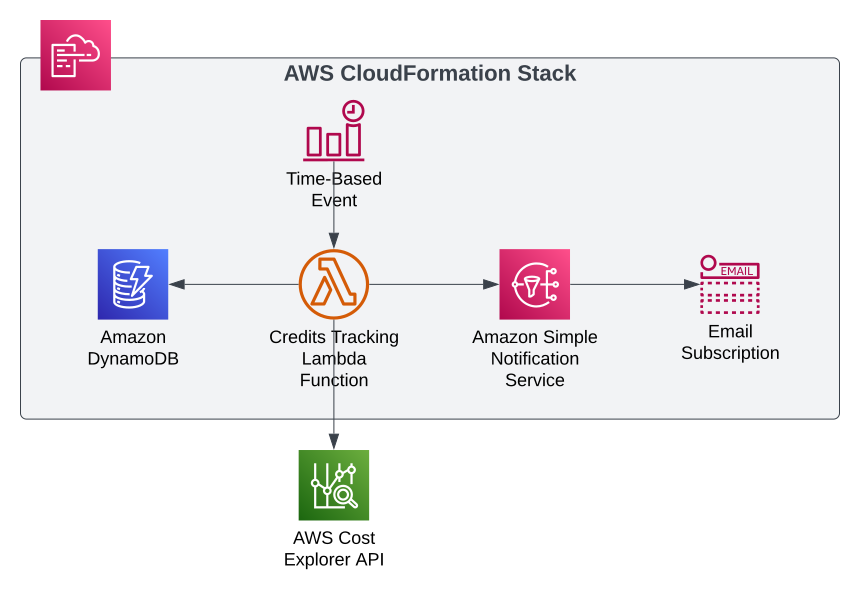

# aws-account-credits-tracker

## Overview
This CloudFormation template is used to build a stack that tracks the AWS account's credit balance. It includes a Lambda function that queries the Cost Explorer API to retrieve the unblended costs, sums them up, and compares the sum with the credit balance. If the remaining credit falls below a user-defined threshold, a notification is sent. Additionally, the stack includes a DynamoDB table for storing information about the credit balance, as well as an SNS topic and subscription for sending notifications when the credit balance falls below the utilization threshold.

## Architecture
This diagram illustrates the serverless architecture of the credits tracking solution on AWS.
 

Figure 1: AWS Credit Tracking Architecture

## Parameters

The CloudFormation template includes the following parameters:
| Variable Name      | Description                                                                                                                | Default Value     |
|--------------------|----------------------------------------------------------------------------------------------------------------------------|-------------------|
| SNSNotificationTopicName | Name of the SNS topic that will be used to send notifications when the credit balance falls below the utilization threshold. | aws-credits-status |
| SNSNotificationEmail | Email address for receiving alerts when the credit balance falls below the utilization threshold. |  |
| CreditsTableName | Name of the DynamoDB table that will be used to store information about the credit balance. | aws-credit-status |
| CreditAwardName | Name of the credit award. |  |
| CreditEffectiveDate | Date on which the credit award becomes effective. This parameter should be a string in the format 'YYYY-MM-DD'.. |  |
| CreditExpiry | Date on which the credit award expires. This parameter should be a string in the format 'YYYY-MM-DD' |  |
| CreditAmount | Amount of credit awarded. This parameter should be a number. | 500.0 |
| AlertThreshold | Credit balance below which an alert should be triggered. This parameter should be a number. | 300 |
| LambdaEventTriggerCron | Cron expression for scheduling the Lambda function to be triggered. This parameter should be a valid cron expression that specifies the frequency at which the function should be triggered. | 0 0 * * ? * |

## Provisioned Resources
The CloudFormation template provisions the following resources:
- CreditsTable (AWS::DynamoDB::Table)
- AlarmAlertTargetSNS (AWS::SNS::Topic)
- AlarmSNSSubscription (AWS::SNS::Subscription)
- InitializeCreditTable (AWS::CloudFormation::CustomResource)
- CreditsTableLambdaInitializer (AWS::Lambda::Function)
- CreditBalanceChecker (AWS::Lambda::Function)
- CreditCheckerEventTrigger (AWS::Events::Rule)

## License
The project is licensed under the MIT license, which allows users to use, modify, and distribute the project's code and documentation for any purpose, as long as the original copyright and license notice is included.